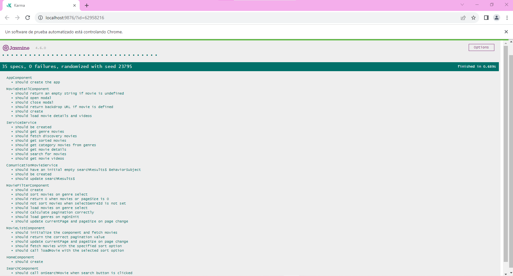
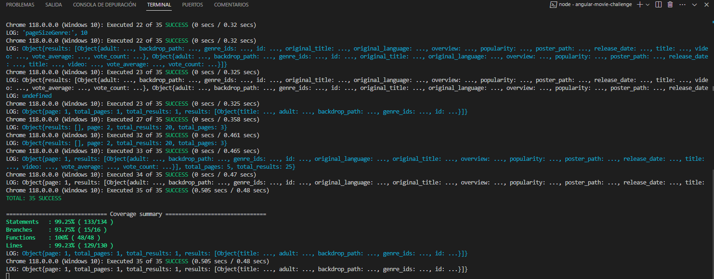

# Movie Challenge

## 2. Definición del producto

Este proyecto tiene la finalidad de contruir una página web que permita al usuario visualizar los estrenos más recientes de la temporada del año 2023. Con el objetivo de implementar la infrestructura del framework Angular en su ultima versión, consumiendo la data de la API [_The Movie Database API V3_](https://developer.themoviedb.org/docs).

De acuerdo a la data de la API [_The Movie Database API V3_](https://developer.themoviedb.org/docs).Se podrá visualizar, filtrar y ordenar el catálogo de películas, de acuerdo a los parametros de discover movies, genres y details.

## 3. Objetivos del producto

Con el objetivo de mostrar los datos de la API [_The Movie Database API V3_](https://developer.themoviedb.org/docs), se establecio la directiva de los endpoint hacer los requestes de cada información solicitada con el objetivo de mostar al usuario los estrenos de las peliculas en tendencia.

#### [Historia de usuario 1] Listado de películas

Yo como usuaria quiero visualizar en un tabla (filas y columnas) el catálogo de películas

##### Criterios de aceptación

- Se debe usar el _endpoint_ [/discover/movie](https://developer.themoviedb.org/reference/discover-movie).
- La aplicación cuenta con una paginación para explorar el catálogo por páginas.
- Para cada película se debe mostrar como mínimo:
poster, título original y año de lanzamiento.

##### Definición de terminado

- Los componentes desarrollados deben contar con test unitarios.

---

#### [Historia de usuario 2] Filtro y ordenamiento

Yo como usuaria quiero filtrar y ordenar el catálogo de películas usando
los criterios soportados por _TheMovie Database API V3_

##### Criterios de aceptación

- Para filtrar se debe usar el _endpoint_
[/discover/movie](https://developer.themoviedb.org/reference/discover-movie),
y alguno de sus parámetros como por ejemplo _with_genres_.
- Para ordenar se debe usar el _endpoint_
[/discover/movie](https://developer.themoviedb.org/reference/discover-movie),
y alguno de sus parámetros como por ejemplo _sort_by_.
- La paginación debe conservar el filtro y ordenamiento
- Para cada película se debe mostrar como mínimo:
poster, título original y año de lanzamiento.

##### Definición de terminado

- Los componentes desarrollados deben contar con test unitarios.

---

#### [Historia de usuario 3] Detalle de una película

Yo como usuaria quiero consultar los detalles de una película

##### Criterios de aceptación

- Se debe usar el _endpoint_
[/movie/{movie_id}](https://developer.themoviedb.org/reference/movie-details).
- Para la película se debe mostrar como mínimo: poster, título original,
año de lanzamiento, géneros, promedio de votación y total de votos.
- La interfaz debe permitir retornar al listado de películas conservando
el filtro y ordenamiento.

##### Definición de terminado

- Los componentes desarrollados deben contar con test unitarios.

---

## 4. Prototipo de baja fidelidad

## 5. Prototipo de alta fidelidad 

LINK del prototipo de alta fidelidad [FIGMA](https://www.figma.com/proto/PVv9DVkXo8SbZZSzjpGYtO/PA-MOVIE?type=design&node-id=45-4&t=E29v7rVtNewAzUHT-1&scaling=min-zoom&page-id=38%3A2&mode=design)

## 6. Uso de tecnolgías para este proyecto

* Angular v.16.2.0: Decidí implementar el uso de este framework por que me brinda una organización de la estructura de los archivos que se pueden ir implementado en el proyecto además de esto coadyuba la eficacia y solides al momento de escribir código.
* Angular Material: Dentro del contexto de angular permite implementar el uso de UI para una maquetación eficiente y sobretodo ayuda en la optimización de tiempos al momento de implementar cada componente.
* Google Font and Material Icon: También ofrece una catálogo amplio de iconos y fuentes que son procias de google y se pueden implementar de una manera optima.
* Postmant: Esta herramienta fue bastante util al momento de hacer el endpoint de la data de la api themoviedb, por que permite hacer los requests y observar que datos son los que seba consultar y utilzar.
* Typescript: De este modo con el manejo de datos pude comprender que tipo de dato utilizar al momento de crear una interface que alamacenar diversos parametros que utilizaria en el proyecto y así darle un uso correcto al tipado de variables.
* Sass (scss): Por ultimo decidi incorporar el manejo de sass en la extención(scss) y lograr un diseño intuitivo e inovador.
* Jasmin y Karma: Como todo gran proyecto debe exitir una forma de respaldar lo que se viene codeando de tal manera que garantize la solidez y seguridad de que el proyecto no colapsara y para esto implemente el uso de (test unitarios), usando propiamente las herramientas que proporciona el framework como tal.

## 7. Conclusión 

Cabe mencionar que el proyecto de moviechallenge apesar de que es tentativamente corto fue una excelente practica para conocer como funciona el modelo-vista-controlador de un proyecto intiuitivo y perspicaz, que coadyuba a implementar el conocimiento adquirido del uso de javascript y logras incorporar el esfuerzo y la dedicación a este proyecto como algo satisfactorio y asu vez seguir conciendo más formas de como solucionar distintas necesidades.

#### DEV-009 ABRIL VARGAS DESAROLLADORA FRONT-END.
