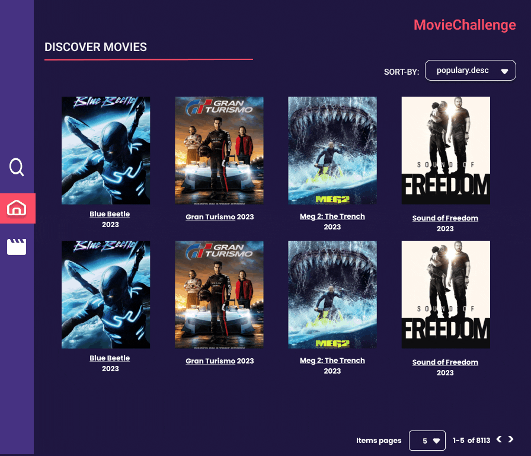

# Movie Challenge

## 2. Definición del producto

Este proyecto tiene la finalidad de contruir una página web que permita al usuario visualizar los estrenos más recientes de la temporada del año 2023. Con el objetivo de implementar la infrestructura del framework Angular en su ultima versión, consumiendo la data de la API [_The Movie Database API V3_](https://developer.themoviedb.org/docs).

De acuerdo a la data de la API [_The Movie Database API V3_](https://developer.themoviedb.org/docs).Se podrá visualizar, filtrar y ordenar el catálogo de películas, de acuerdo a los parametros de discover movies, genres y details.

## 3. Objetivos del producto

Con el objetivo de mostrar los datos de la API [_The Movie Database API V3_](https://developer.themoviedb.org/docs), se establecio la directiva de los endpoint hacer los requestes de cada información solicitada con el objetivo de mostar al usuario los estrenos de las peliculas en tendencia.

#### [Historia de usuario 1] Listado de películas

Yo como usuaria quiero visualizar en un tabla (filas y columnas) el catálogo de películas

##### Criterios de aceptación

- Se debe usar el _endpoint_ [/discover/movie](https://developer.themoviedb.org/reference/discover-movie).
- La aplicación cuenta con una paginación para explorar el catálogo por páginas.
- Para cada película se debe mostrar como mínimo:
poster, título original y año de lanzamiento.

##### Definición de terminado

- Los componentes desarrollados deben contar con test unitarios.

---

#### [Historia de usuario 2] Filtro y ordenamiento

Yo como usuaria quiero filtrar y ordenar el catálogo de películas usando
los criterios soportados por _TheMovie Database API V3_

##### Criterios de aceptación

- Para filtrar se debe usar el _endpoint_
[/discover/movie](https://developer.themoviedb.org/reference/discover-movie),
y alguno de sus parámetros como por ejemplo _with_genres_.
- Para ordenar se debe usar el _endpoint_
[/discover/movie](https://developer.themoviedb.org/reference/discover-movie),
y alguno de sus parámetros como por ejemplo _sort_by_.
- La paginación debe conservar el filtro y ordenamiento
- Para cada película se debe mostrar como mínimo:
poster, título original y año de lanzamiento.

##### Definición de terminado

- Los componentes desarrollados deben contar con test unitarios.

---

#### [Historia de usuario 3] Detalle de una película

Yo como usuaria quiero consultar los detalles de una película

##### Criterios de aceptación

- Se debe usar el _endpoint_
[/movie/{movie_id}](https://developer.themoviedb.org/reference/movie-details).
- Para la película se debe mostrar como mínimo: poster, título original,
año de lanzamiento, géneros, promedio de votación y total de votos.
- La interfaz debe permitir retornar al listado de películas conservando
el filtro y ordenamiento.

##### Definición de terminado

- Los componentes desarrollados deben contar con test unitarios.

---

## 7. Prototipo de alta fidelidad 

## 8. Uso de tecnolgías para este proyecto

* Angular v.16.2.0
* Angular Material
* Google Font and Material Icon
* Postmant
* Sass (scss)
* JavaScript

### Planifica la implementación de la primera historia de usuaria

Toma la primera historia de usuaria y
divídela en tareas más pequeñas. Identifica
el orden y prioridad de cada tarea.
Documenta tu planificacion en Trello o Github Project.

### Implementa tu primer componente

Toma la primera vista de prototipo de alta e implementala.
Te sugerimos seguir los siguientes
pasos independiente del framework  que uses:

- Paso 1: Separa la UI en una jerarquía de componentes
- Paso 2: Construye una versión estática de la UI sin añadir ninguna
interactividad aún
- Paso 3: Encuentra la representación mínima pero completa del estado de la UI.
Piensa en el estado como el conjunto mínimo de datos cambiantes que
la aplicación necesita recordar.
- Paso 4: Después de identificar los datos mínimos de estado de tu aplicación,
debes identificar qué componente es responsable de cambiar este estado,
o posee el estado.
- Paso 5: Identifica el flujo de comunicación entre cada componente:
padre a hijo o hijo a padre. Implementa la estrategia identificada tal como
te sugiere el framework.

